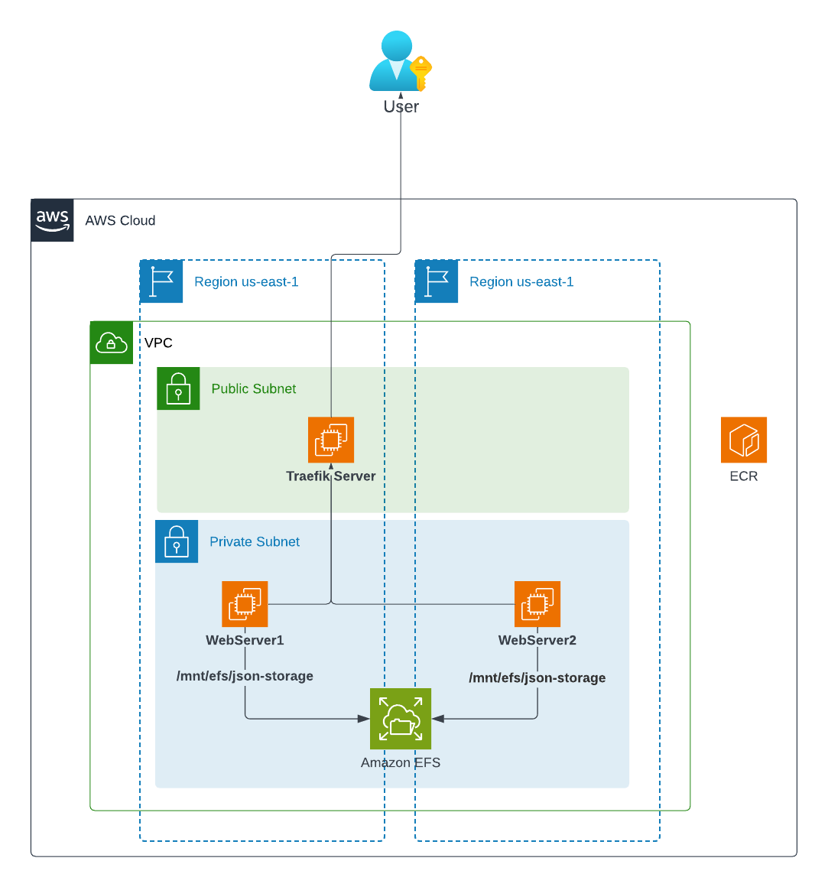
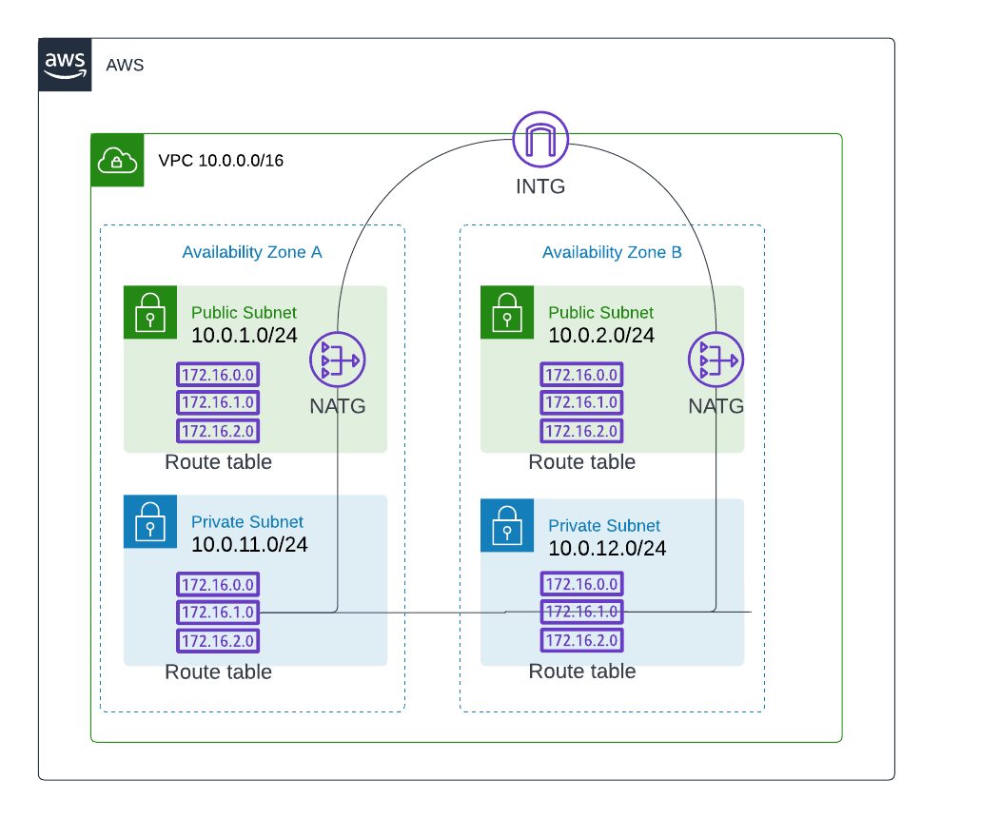

# API Infrastructure - High Availability AWS CloudFormation

Este repositorio contiene la infraestructura como código (IaC) para desplegar una API de alta disponibilidad en AWS usando CloudFormation.

## Descripción General

La infraestructura despliega una arquitectura de alta disponibilidad con:
- 2 zonas de disponibilidad (AZ)
- Subredes públicas y privadas
- Load balancer Traefik
- Servidores web con Docker
- Almacenamiento compartido con EFS

## Arquitectura de Infraestructura

### Diagrama General



### Componentes Principales

La arquitectura implementa un patrón de alta disponibilidad con los siguientes componentes:

#### Load Balancer
- **Traefik Server**: Proxy reverso y load balancer dinámico ubicado en la subnet pública
  - Distribuye automáticamente el tráfico entre los servidores web
  - Configuración dinámica mediante archivos de configuración
  - Soporte para múltiples backends y rutas

#### Servidores de Aplicación
- **WebServer1 (AZ-A)**: Servidor en la primera zona de disponibilidad
- **WebServer2 (AZ-B)**: Servidor en la segunda zona de disponibilidad
- Ambos servidores:
  - Ejecutan contenedores Docker con la aplicación
  - Acceden al almacenamiento compartido EFS
  - Se encuentran en subnets privadas para mayor seguridad

#### Almacenamiento
- **Amazon EFS**: Sistema de archivos compartido
  - Montado en `/mnt/efs/json-storage` en ambos servidores
  - Permite compartir datos JSON entre instancias
  - Alta disponibilidad y escalabilidad automática

#### Registro de Contenedores
- **Amazon ECR**: Repositorio privado de imágenes Docker
  - Almacena las imágenes de la aplicación
  - Integración nativa con servicios AWS
  - Control de acceso mediante IAM

## Arquitectura de Red (Networking)

### Diagrama de Red



### Componentes de Red

#### Conectividad
- **VPC (10.0.0.0/16)**: Red virtual privada aislada
- **Internet Gateway (INTG)**: Proporciona conectividad bidireccional con Internet
- **NAT Gateways**: Permiten salida a Internet desde subnets privadas

#### Distribución de Subnets

**Zona de Disponibilidad A:**
- **Subnet Pública (10.0.1.0/24)**
  - Hosts: Traefik Load Balancer, NAT Gateway
  - Acceso directo a Internet vía Internet Gateway
- **Subnet Privada (10.0.11.0/24)**
  - Hosts: WebServer1
  - Salida a Internet vía NAT Gateway

**Zona de Disponibilidad B:**
- **Subnet Pública (10.0.2.0/24)**
  - Reservada para futura expansión
  - NAT Gateway para redundancia
- **Subnet Privada (10.0.12.0/24)**
  - Hosts: WebServer2
  - Salida a Internet vía NAT Gateway

#### Enrutamiento
- **Tablas de Rutas Públicas**: 
  - Ruta por defecto (0.0.0.0/0) → Internet Gateway
  - Rutas locales para comunicación VPC
- **Tablas de Rutas Privadas**:
  - Ruta por defecto (0.0.0.0/0) → NAT Gateway
  - Rutas locales para comunicación interna
  - IPs 172.16.x.0 configuradas para servicios internos

## Recursos AWS

### Networking

| Recurso | Descripción | CIDR/Detalles |
|---------|-------------|---------------|
| **VPC** | Red virtual principal | `10.0.0.0/16` |
| **Internet Gateway** | Acceso a internet | - |
| **NAT Gateway** | Salida a internet para subredes privadas | 1 NAT Gateway |
| **Elastic IP** | IP pública para NAT Gateway | - |

### Subredes

| Tipo | Zona | CIDR | Descripción |
|------|------|------|-------------|
| **Pública AZ1** | us-east-1a | `10.0.1.0/24` | Traefik Load Balancer |
| **Pública AZ2** | us-east-1b | `10.0.2.0/24` | Reservada |
| **Privada AZ1** | us-east-1a | `10.0.11.0/24` | Web Server 1 |
| **Privada AZ2** | us-east-1b | `10.0.12.0/24` | Web Server 2 |

### Instancias EC2

| Nombre | Tipo | Subnet | Software | Propósito |
|--------|------|--------|----------|-----------|
| **Traefik-LoadBalancer** | t2.micro | Pública AZ1 | Traefik | Balanceador de carga |
| **WebServer-AZ1** | t2.micro | Privada AZ1 | Docker | Servidor de aplicación |
| **WebServer-AZ2** | t2.micro | Privada AZ2 | Docker | Servidor de aplicación |

### Almacenamiento

| Recurso | Tipo | Tamaño | Propósito |
|---------|------|--------|-----------|
| **EFS FileSystem** | General Purpose | Elástico | Almacenamiento compartido JSON |
| **EBS Volume AZ1** | GP2 | 50 GB | Volumen adicional Web Server 1 |
| **EBS Volume AZ2** | GP2 | 50 GB | Volumen adicional Web Server 2 |

### Contenedores

| Recurso | Tipo | Propósito |
|---------|------|-----------|
| **ECR Repository** | Private Registry | Almacenamiento de imágenes Docker de la aplicación |

### Seguridad

| Security Group | Puerto | Protocolo | Origen | Descripción |
|----------------|--------|-----------|---------|-------------|
| **Traefik-SG** | 80 | TCP | 0.0.0.0/0 | HTTP público |
| **Traefik-SG** | 443 | TCP | 0.0.0.0/0 | HTTPS público |
| **WebServer-SG** | 80 | TCP | Traefik-SG | HTTP desde LB |
| **EFS-SG** | 2049 | TCP | WebServer-SG | NFS mount |

### IAM

| Recurso | Tipo | Políticas | Propósito |
|---------|------|-----------|-----------|
| **SSMRole** | IAM Role | AmazonSSMManagedInstanceCore | Acceso SSM a instancias |
| **SSMInstanceProfile** | Instance Profile | - | Perfil para EC2 |

## Despliegue

### Requisitos Previos

1. Cuenta AWS con permisos administrativos
2. AWS CLI configurado
3. GitHub repository con Actions habilitado

### Variables Requeridas

En GitHub Settings → Secrets and variables → Actions:

**Secrets:**
- `AWS_ROLE_ARN`: ARN del rol IAM para GitHub Actions

**Variables:**
- `AWS_REGION`: Región AWS (default: us-east-1)
- `STACK_NAME`: Nombre del stack CloudFormation

### Despliegue Automático

El despliegue se ejecuta automáticamente al hacer push a la rama `main`:

```bash
git add cf_template.yml
git commit -m "Update infrastructure"
git push origin main
```


## CI/CD Pipeline

### Validación (PR a main)
- **cfn-lint**: Validación de sintaxis
- **cfn-nag**: Análisis de seguridad
- **validate-template**: Validación AWS


## Mantenimiento

### Actualizar la infraestructura
1. Modifica `cf_template.yml`
2. Crea PR a `main`
3. Espera validación
4. Merge → Deploy automático

### Monitoreo
- CloudWatch Logs para instancias
- CloudFormation Events para stack
- EC2 Instance Status Checks

## Notas Importantes

1. **AMI ID**: La AMI actual (`ami-020cba7c55df1f615`) debe ser actualizada según la región
2. **Acceso SSH**: No configurado por defecto. Usar SSM Session Manager
3. **Traefik Config**: Requiere configuración manual post-despliegue
4. **Docker**: Pre-instalado en servidores web vía UserData

